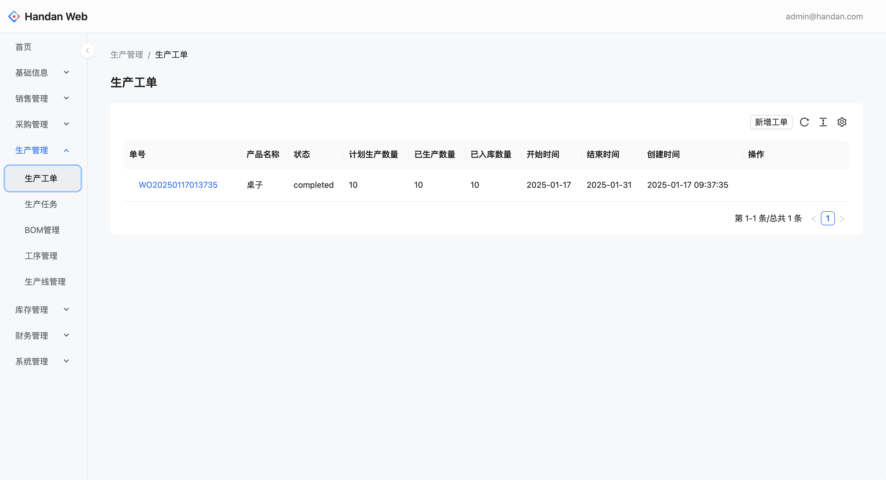

# Handan :construction: :construction: :construction: 

English | [简体中文](./README.CN.md)

Handan is a project under construction, it is one of the ERP (MES) solutions for small and medium-sized enterprises.

The frontend page is based on `NextJS` framework, [click here](https://github.com/zven21/handan_web).

	

	<a href="https://handan-web.vercel.app">Live Demo</a>

## Intro

Many small enterprises face a dilemma when seeking ERP (MES) software. The relevant software on the market either has overly complex functions. When using it, enterprises need to spend a lot of time and energy on learning and adapting, which makes it difficult for employees to get started and may even reduce work efficiency instead of increasing it. Or the price is exorbitant. For small  enterprises with relatively limited funds and resources, the procurement and subsequent maintenance costs become a heavy burden, greatly restricting the pace of the enterprises' digital transformation.

Based on a profound understanding of these pain points, we are determined to independently develop a configurable - process ERP (MES) system suitable for small enterprises.

At present, we have successfully completed the MVP version. Although there may still be some minor bugs at this stage, the core business processes, that is, what we often call the "happy path", can be successfully completed. This means that the most critical business operations of enterprises, such as production plan formulation, material management, order tracking, etc., can be efficiently achieved through this system.

## **Getting Started**

To start your Phoenix server and run tests:

* Run `mix setup` to install and setup dependencies
* Run `mix test` to run tests for your application
* Start Phoenix endpoint with `mix phx.server` or inside IEx with `iex -S mix phx.server`
* Now you can visit `http://localhost:4000` from your browser.

## **Technologies Used**

### Backend Technology

This project utilizes the following technologies:

* **Phoenix**: A web framework for Elixir that allows for the creation of fast, scalable, and maintainable web applications.
* **Commanded(CQRS)**: A command handling framework for building event-driven systems.
* **Absinthe(GraphQL)**: A query language for APIs that allows for more flexible and efficient data retrieval.

### Frontend Technology

* **NextJS**: A React framework for building server-side rendered applications.
* **TailwindCSS**: A utility-first CSS framework for building modern websites.	
* **Apollo Client(GraphQL)**: A fully-featured, production ready caching GraphQL client for every UI framework and GraphQL server.
* **Zustand**: Bear necessities for state management in React.

## **Flow Diagram**

## **Features**

- [x] MVP 
- [x] Accounts Context
- [ ] Enterprise Context
- [ ] Stock Context
- [ ] Selling Context
- [ ] Purchasing Context
- [ ] Production Context
- [ ] Finance Context
- [ ] Subcontracting Context

## **Contributing**

Bug report or pull request are welcome.

## **Make a pull request**

1. Fork it
2. Create your feature branch (`git checkout -b my-new-feature`)
3. Commit your changes (`git commit -am 'Add some feature'`)
4. Push to the branch (`git push origin my-new-feature`)
5. Create new Pull Request

Please write unit test with your code if necessary.

## **License**

handan is available as open source under the terms of the [MIT License](http://opensource.org/licenses/MIT).