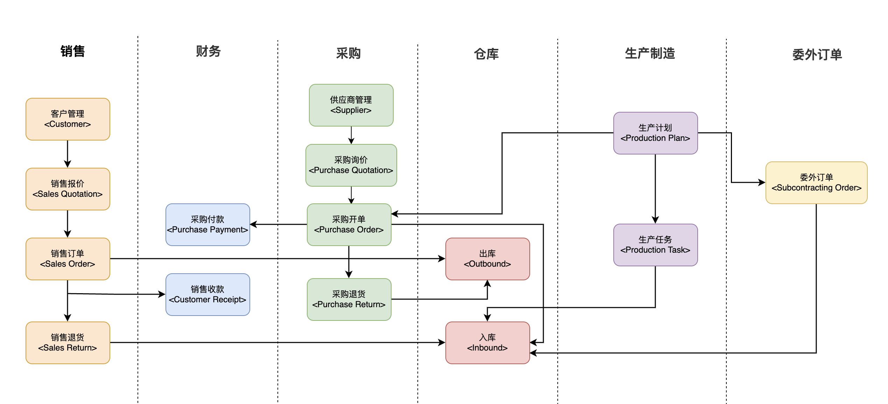

# Handan :construction: :construction: :construction: 

English | [简体中文](./README.CN.md)

Handan is a project under construction, it is one of the ERP (MES) solutions for small and medium-sized enterprises.

The frontend page is based on `NextJS` framework, [click here](https://github.com/zven21/handan_web).

## **Getting Started**

To start your Phoenix server and run tests:

* Run `mix setup` to install and setup dependencies
* Run `mix test` to run tests for your application
* Start Phoenix endpoint with `mix phx.server` or inside IEx with `iex -S mix phx.server`
* Now you can visit `http://localhost:4000` from your browser.

## **Technologies Used**

This project utilizes the following technologies:

* **Phoenix**: A web framework for Elixir that allows for the creation of fast, scalable, and maintainable web applications.
* **Commanded(CQRS)**: A command handling framework for building event-driven systems.
* **Absinthe(GraphQL)**: A query language for APIs that allows for more flexible and efficient data retrieval.

## **Flow Diagram**

## **Features**

- [x] Core Domain Model
- [x] Accounts
- [x] Enterprise
- [x] Stock && Item
- [x] Selling
- [x] Purchasing
- [x] Production
- [x] Finance
- [x] Subcontracting
- [x] GraphQL API

## **Contributing**

Bug report or pull request are welcome.

## **Make a pull request**

1. Fork it
2. Create your feature branch (`git checkout -b my-new-feature`)
3. Commit your changes (`git commit -am 'Add some feature'`)
4. Push to the branch (`git push origin my-new-feature`)
5. Create new Pull Request

Please write unit test with your code if necessary.

## **License**

handan is available as open source under the terms of the [MIT License](http://opensource.org/licenses/MIT).